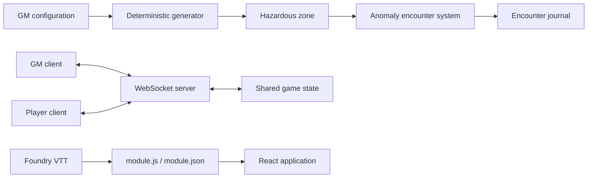

# Anomaly Zone VTT

[](https://github.com/theDAREK497/anomaly-zone-vtt/actions/workflows/ci.yml)

A procedural browser mini-game and Foundry VTT utility for hazardous-zone exploration in post-apocalyptic and science-fiction tabletop campaigns.

The project combines deterministic map generation, hidden information, anomaly encounters, player/GM interaction and a WebSocket-backed multiplayer support layer.

> Independent tabletop utility. It is not affiliated with any referenced commercial franchise.

## Highlights

- deterministic procedural maps based on seed and salt;
- protected route generation between the entrance and an exit;
- configurable anomaly and radiation density;
- 14 anomaly definitions with multiple encounter styles;
- 7 field encounters, 4 interactive puzzle encounters and 3 roll-driven encounters;
- anomaly journal and encounter state;
- player tools for probing, radiation scanning and artifact detection;
- GM controls and reveal/debug workflows;
- WebSocket synchronization between GM and players;
- Foundry VTT module metadata and integration files;
- automated gameplay and server integration checks.

## Architecture



## Anomaly system

The anomaly catalogue currently contains 14 definitions split across three gameplay styles:

- **7 field encounters** for immediate environmental effects;
- **4 puzzle encounters** with deterministic, seed-based challenges;
- **3 roll-driven encounters** for tabletop-style resolution.

The validation script checks catalogue consistency, deterministic generation, puzzle solvability, seeded field outcomes, dice distribution and encounter timer rules.

## Automated validation

The repository includes two purpose-built test scripts rather than only UI smoke tests.

`npm run check:anomalies` validates the core anomaly catalogue and gameplay logic across hundreds of generated cases.

`npm run test:anomaly-server` builds and starts the production server, connects WebSocket clients and checks multiplayer/server behaviour including encounter completion, timers, pause/resume, acknowledgement, failure states, retreat, damage and movement effects.

## Tech stack

| Area | Technology |
| --- | --- |
| UI | React 19 |
| Language | TypeScript |
| Build | Vite, esbuild |
| Styling | Tailwind CSS |
| Motion / icons | Motion, Lucide React |
| Server | Node.js, Express |
| Realtime | WebSocket (`ws`) |
| VTT integration | Foundry VTT module files |
| CI | GitHub Actions |

## Local development

```bash
git clone https://github.com/theDAREK497/anomaly-zone-vtt.git
cd anomaly-zone-vtt
npm ci
npm run dev
```

## Validation

Run the complete local validation sequence:

```bash
npm run lint
npm run check:anomalies
npm run build
npm run test:anomaly-server
npm audit
```

The server integration test expects the production bundle from `npm run build`.

## Foundry VTT

The repository includes:

```text
module.json
module.js
app-template.html
dist/
```

Manifest URL:

```text
https://raw.githubusercontent.com/theDAREK497/anomaly-zone-vtt/main/module.json
```

The module metadata targets Foundry compatibility from v11 and is currently marked as verified through v14.

## Repository structure

```text
src/
  components/               React gameplay/UI components
  data/anomalies.ts         anomaly catalogue
  utils/generator.ts        deterministic zone generation
  utils/anomaly-gameplay.ts anomaly encounter logic
scripts/
  validate-anomalies.ts     deterministic/gameplay validation
  test-anomaly-server.ts    WebSocket/server integration checks
server.ts                   multiplayer support server
module.json                 Foundry VTT metadata
module.js                   Foundry integration
db_*.json                   configurable local game data
dist/                       production output
```

## Engineering focus

The project is primarily an exploration of deterministic procedural systems and stateful multiplayer tabletop tooling.

The most important invariants are executable rather than only documented: the anomaly catalogue, generated puzzles, random outcomes, encounter timers and multiplayer server flows are covered by automated validation scripts and CI.

## License

Mozilla Public License 2.0. See `LICENSE`.
