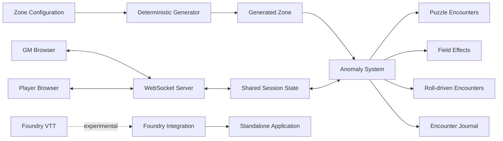
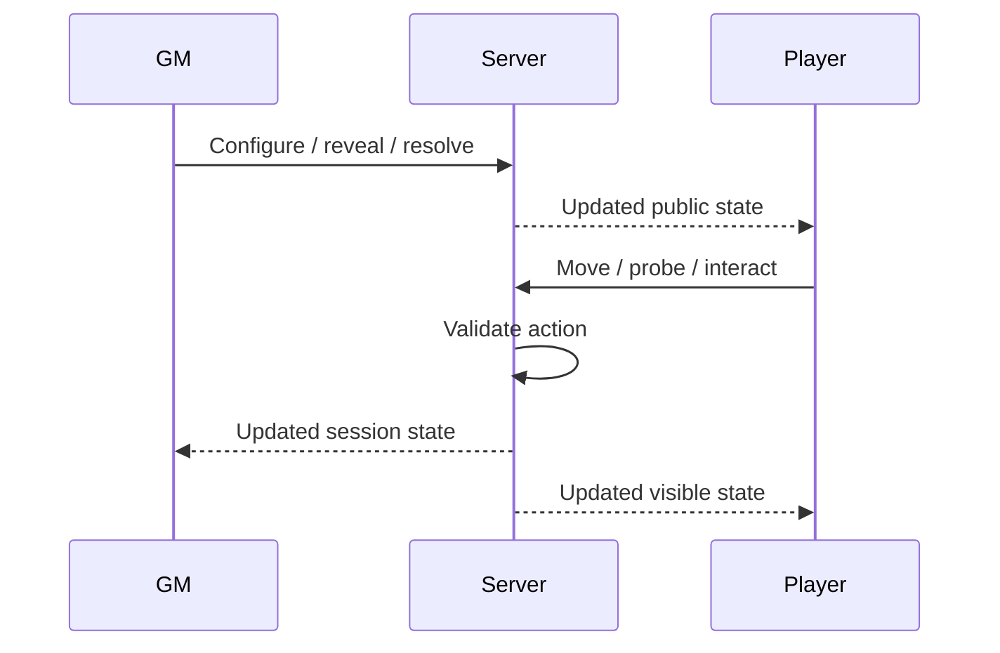

# Anomaly Zone

[](https://github.com/theDAREK497/anomaly-zone/actions/workflows/ci.yml)

A standalone procedural multiplayer mini-game for hazardous-zone exploration in tabletop campaigns.

Anomaly Zone combines deterministic procedural generation, interactive anomalies, hidden information, GM/player roles and real-time WebSocket synchronization in a browser-based application.

> **Status:** standalone application milestone.
> The browser/server version is the primary and most thoroughly validated way to run the project. Foundry VTT integration is included as an experimental secondary integration.

---

## Why this project exists

Hazardous-zone exploration in tabletop games often relies heavily on manual preparation by the game master.

Anomaly Zone explores a different approach: generate a dangerous environment deterministically, keep parts of the world hidden from players, resolve interactive anomalies through several gameplay systems, and synchronize the session between GM and player clients.

The project focuses on several engineering problems at once:

* deterministic procedural content generation;
* multiplayer state synchronization;
* hidden-information gameplay;
* reproducible random encounters;
* interactive puzzle generation;
* server-authoritative encounter state;
* automated validation of procedural systems.

The goal is not to replace a tabletop RPG system, but to provide a specialized interactive tool that can run alongside one.

---

## Highlights

* deterministic procedural zone generation based on seeds;
* configurable anomaly and radiation density;
* protected route generation between entrance and exit;
* 14 anomaly definitions with several encounter styles;
* interactive deterministic puzzle encounters;
* environmental field anomalies;
* tabletop-style roll-driven encounters;
* anomaly journal and encounter history;
* probing and exploration tools for players;
* radiation scanning and artifact detection;
* separate GM and player workflows;
* WebSocket-based real-time synchronization;
* configurable local game data;
* production React build;
* Node.js / Express multiplayer server;
* automated gameplay validation;
* automated WebSocket integration tests;
* GitHub Actions CI and dependency security checks.

---

## Application architecture



The standalone application is intentionally independent from Foundry VTT.

The React frontend communicates with a Node.js server that maintains multiplayer session state and synchronizes GM/player actions through WebSockets.

---

## Anomaly system

The current catalogue contains **14 anomaly definitions** split across three main gameplay styles.

### Field encounters

Environmental anomalies apply immediate or persistent effects to characters entering hazardous areas.

These encounters are designed around environmental danger, movement restrictions, damage and changing map conditions.

### Puzzle encounters

Puzzle anomalies create deterministic challenges derived from the generated encounter state.

Because generation is seed-based, the same input produces the same puzzle. This makes the system reproducible and testable instead of relying on uncontrolled randomness.

### Roll-driven encounters

Some anomalies use tabletop-style resolution where outcomes are determined through dice mechanics and character actions.

This allows Anomaly Zone to work alongside traditional RPG mechanics rather than replacing them entirely.

---

## Deterministic generation

Procedural generation is one of the central engineering components of the project.

The generator uses deterministic seeds so generated environments and encounters can be reproduced.

This is important for both gameplay and testing:

```text
same seed + same configuration
                ↓
     same generated result
```

The automated validation suite repeatedly generates zones and anomaly encounters across many seeds and checks important invariants.

Examples include:

* protected routes remain traversable;
* deterministic puzzles reproduce correctly;
* generated puzzle states remain solvable;
* field events produce valid outcomes;
* timers stay within expected rules;
* dice behaviour remains within expected distributions.

---

## Multiplayer model

The standalone application supports separate GM and player clients.



The server acts as the shared session authority.

This makes it possible to keep GM-only information hidden while synchronizing public encounter state between connected clients.

---

## Automated validation

The repository contains purpose-built validation scripts for both procedural gameplay and multiplayer server behaviour.

### Gameplay validation

```bash
npm run check:anomalies
```

The anomaly validation script checks the catalogue and generated gameplay across hundreds of cases.

It validates areas such as:

* anomaly definition consistency;
* deterministic generation;
* puzzle generation;
* puzzle solvability;
* seeded environmental outcomes;
* timer rules;
* dice behaviour.

### Server integration testing

```bash
npm run test:anomaly-server
```

The integration suite builds and starts the production server, connects WebSocket clients and exercises multiplayer gameplay flows.

Covered behaviour includes:

* puzzle anomaly interactions;
* encounter completion;
* acknowledgement flow;
* independent timers;
* pause and resume;
* timer expiration;
* repeated failures;
* blocked movement;
* retreat behaviour;
* anomaly journal updates;
* environmental damage;
* anomaly expansion;
* forced movement effects.

These tests validate the actual WebSocket server rather than only testing isolated functions.

---

## Tech stack

| Area                    | Technology                          |
| ----------------------- | ----------------------------------- |
| Frontend                | React 19                            |
| Language                | TypeScript                          |
| Build                   | Vite, esbuild                       |
| Styling                 | Tailwind CSS                        |
| UI motion               | Motion                              |
| Icons                   | Lucide React                        |
| Server                  | Node.js, Express                    |
| Realtime communication  | WebSocket (`ws`)                    |
| Procedural systems      | deterministic TypeScript generators |
| Optional AI integration | Google GenAI SDK                    |
| VTT integration         | experimental Foundry VTT adapter    |
| CI                      | GitHub Actions                      |

---

## Local development

### Requirements

* Node.js 24 recommended
* npm

Clone the repository:

```bash
git clone https://github.com/theDAREK497/anomaly-zone-vtt.git
cd anomaly-zone-vtt
```

Install dependencies:

```bash
npm ci
```

Start the development server:

```bash
npm run dev
```

---

## Production build

Build both the frontend and server:

```bash
npm run build
```

The build command creates:

* the Vite frontend bundle;
* the bundled Node.js server.

Start the production server:

```bash
npm run start
```

The server bundle is generated as:

```text
dist/server.cjs
```

---

## Validation

Run the complete local validation sequence:

```bash
npm run lint
npm run check:anomalies
npm run build
npm run test:anomaly-server
npm audit
```

`npm run lint` performs TypeScript type checking with:

```bash
tsc --noEmit
```

The server integration test expects the production bundle produced by `npm run build`.

---

## CI

GitHub Actions validates the project automatically.

The CI pipeline checks:

* TypeScript compilation;
* anomaly catalogue and procedural generation;
* production build;
* multiplayer server integration;
* dependency security.

The goal is to keep important procedural and multiplayer invariants executable rather than relying only on documentation.

---

## Configurable game data

Several parts of the application use local JSON configuration.

Examples include:

```text
db_players.json
db_shop_items.json
db_tavern_settings.json
```

These files allow game content and session-related configuration to remain inspectable and editable without requiring a separate database service.

---

## Repository structure

```text
src/
  components/                 React gameplay and UI components
  data/
    anomalies.ts              anomaly catalogue
  utils/
    generator.ts              deterministic zone generation
    anomaly-gameplay.ts       encounter gameplay logic

scripts/
  validate-anomalies.ts       procedural/gameplay validation
  test-anomaly-server.ts      WebSocket server integration tests

server.ts                     multiplayer Node.js server

db_players.json               local player configuration
db_shop_items.json            local item configuration
db_tavern_settings.json       local settings

index.html                    standalone web entry point
vite.config.ts                frontend build configuration
tsconfig.json                 TypeScript configuration

module.js                     experimental Foundry integration
module.json                   Foundry module metadata
app-template.html             Foundry application template

dist/                         production build output
```

---

## Foundry VTT integration

The repository contains an experimental Foundry VTT integration:

```text
module.json
module.js
app-template.html
```

The original version of the project was designed to work closely with Foundry VTT.

During development, however, the standalone browser/server architecture became the more reliable and flexible way to run the application.

For that reason:

> **The Foundry integration should currently be considered experimental and is not the primary supported runtime.**

Some functionality may behave differently or be less reliable when launched through Foundry compared with the standalone application.

The integration remains in the repository as an architectural experiment and as a possible direction for future development.

---

## Current scope

Anomaly Zone is a portfolio-scale standalone application rather than a production-hosted multiplayer service.

The current focus is on:

* procedural systems;
* deterministic generation;
* multiplayer synchronization;
* gameplay state management;
* automated validation;
* tabletop tooling experiments.

A larger production deployment would require additional infrastructure such as persistent session storage, authentication, deployment automation, monitoring and more extensive network-failure handling.

Those concerns are intentionally outside the current project scope.

---

## Engineering focus

The most important part of Anomaly Zone is not the number of UI screens or content entries.

The project is primarily an exploration of **deterministic procedural systems and synchronized multiplayer state**.

Several gameplay behaviours that are often difficult to test in procedural games are covered by executable validation:

```text
procedural generation
        +
interactive encounters
        +
shared multiplayer state
        +
automated invariants
```

This allows changes to gameplay systems to be checked against hundreds of generated cases and real server/client interaction flows.

---

## Status

### Standalone application

**Primary implementation**

The standalone browser/server application is the recommended way to run and evaluate the project.

### Foundry VTT

**Experimental integration**

Foundry integration is retained for experimentation but is not currently presented as production-ready.

---

## License

Mozilla Public License 2.0.

See [LICENSE](LICENSE).
